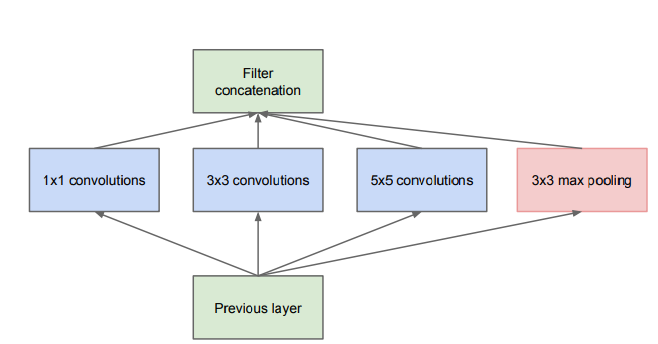
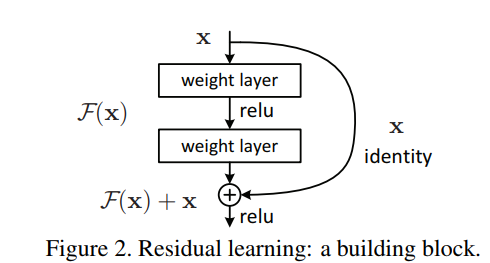

```{r, echo = FALSE}
knitr::opts_chunk$set(warning = FALSE, message = FALSE, out.width = "100%")

# programming 
library(tensorflow)
library(keras)
```

# {.tabset}

## Intro

This is a work-through of the tutorials on the [Keras Homepage for R](https://keras.rstudio.com/index.html).

## Basics 
 
### Check GPU Availability

```{r}
K = backend()
sess = K$get_session()
sess$list_devices()
```

#### Build a Simple Model 

```{r}
# build a simple fully connected network
model <- keras_model_sequential()

model %>%
    layer_dense(units = 64, activation = "relu") %>%
    layer_dense(units = 64, activation = "relu") %>%
    layer_dense(units = 10, activation = "softmax")
```

#### Configure the Layers

There are many layers available with some common constructor parameters: 

- `activation`: set the activation function for the layer. 
- `kernel_initializer`, `bias_initializer`: create the layers initial weights (kernel and bias). This defaults to the `Glorot uniform` initializer. 
- `kernel_regularizer`, `bias_regularizer`: The regularization schemes that apply to the layer's weights (kernels and bias), such as L1 or L2 regularization. By default, no regularization is applied. 

The following instantiates `dense` layers using constructor arguments.

```{r}
# sigmoid layer
layer_dense(units = 64, activation = "sigmoid")

# linear layer with L1 regularization of factor 0.01 applied to the kernel matrix
layer_dense(units = 64, kernel_regularizer = regularizer_l1(0.01))

# a linear layer with L2 regularization of factor 0.01 applied to the bias vector
layer_dense(units = 64, bias_regularizer = regularizer_l2(0.01))

# a linear layer with a bias vector initialized to 2.0
layer_dense(units = 64, bias_initializer = initializer_constant(2.0))
```

#### Train and Evaluate 

```{r}
# compile
model %>% compile(
              optimizer = "adam",
              loss = "categorical_crossentropy",
              metrics = list("accuracy")
          )
```

`compile` takes 3 important arguments: 

- `optimizer` : This object specifies the training procedure. [Overview of Gradient Descent Algorithms](http://ruder.io/optimizing-gradient-descent/index.html)

- `loss`: The function to minimize during optimization. Common choices include mean squared error for regression, categorical_crossentropy for multiclass classification, and binary_crossentropy for binary classification. 

- `metrics`: Used to monitor training. In classification, this is usually accuracy. 

```{r}
# configure a model for mean-squared error regression
model %>% compile(
              optimizer = "adam",
              loss = "mse",
              metrics = list("mae")
          )

# configure a model for categorical classification
model %>% compile(
              optimizer = optimizer_rmsprop(lr = 0.01),
              loss = "categorical_crossentropy",
              metrics = list("categorical_accuracy")
)
```

#### Input Data

We can train keras models directly on R matrices and arrays. A model is fit to the training data using the fit method. 

```{r}
data <- matrix(rnorm(1000 * 32), nrow = 1000, ncol = 32)
labels <- matrix(rnorm(1000 * 10), nrow = 1000, ncol = 10)

model %>% fit(
              data,
              labels,
              epochs = 10,
              batch_size = 32
          )
```

`fit` takes three important arguments: 

- `epochs` : Training is structured into epochs. An epoch is one iteration over the entire input data (this is done in smaller batches)
- `batch_size` : When passed matrix or array data, the model slices the data into smaller batches and iterates over these batches during training. This integer specifies the size of each batch. Be aware that the last batch may be smaller if the total number of samples is not divisible by batch size. 
- `validation_data` : When prototyping a model, we want to easily monitor its performance on some validation data. Passing this argument - a list of inputs and labels - allows the model to display the loss and metrics in inference mode for the apssed data, at the end of each epoch.

```{r}
# example with validation data
data <- matrix(rnorm(100 * 32), nrow = 1000, ncol = 32)
labels <- matrix(rnorm(1000 * 10), nrow = 1000, ncol = 10)

val_data <- matrix(rnorm(1000 * 32), nrow = 100, ncol = 32)
val_labels <- matrix(rnorm(100 * 10), nrow = 100, ncol = 10)

model %>% fit(
              data,
              labels,
              epochs = 10,
              batch_size = 32,
              validation_data = list(val_data, val_labels)
)
```

#### Evaluate and Predict 

Same as fit, the evaluate and predict methods can use raw R data as well as a dataset. 

```{r}
# evaluate the inference mode loss and metrics for the data
## model %>% evaluate(test_data, test_labels, batch_size = 32)
## model %>% evaluate(test_dataset, steps = 30)

# predict
## model %>% predict(test_data, batch_size = 32)
## model %>% predict(test_dataset, steps = 30)
```

### Build Advanced Models 

#### Functional API

The Keras functional API is used to build complex model topologies, such as: 

- multi-input models
- multi-output models
- models with shared layers (the same layer called several times)
- models with non-sequential data flows (e.g., residual connections)

Building a model with the functional API works like this: 

1. A layer instance is callable and returns a tensor 
2. Input tensors and output tensors are used to define a keras_model instance
3. This model is trained just like the sequential model 

```{r}
# build a fully connected network with the functional api
inputs <- layer_input(shape = (32)) # return placeholder tensor

predictions <- inputs %>%
    layer_dense(units = 64, activation = "relu") %>%
    layer_dense(units = 64, activation = "relu") %>%
    layer_dense(units = 10, activation = "softmax")

# instantiate the model given inputs and outputs
model <- keras_model(inputs, outputs = predictions)

# compile step specifies the training configuration
model %>% compile(
              optimizer = optimizer_rmsprop(lr = 0.001),
              loss = "categorical_crossentropy",
              metrics = list("accuracy")
          )

model %>% fit(
              data,
              labels,
              batch_size = 32,
              epochs = 5
          )
```

#### Custom Layers

To create a custom layer, we can create an R6 class derived from `KerasLayer`. There are three methods to implement (only one of which, call(), is required for all types of layer). 

- `build(input_shape)` : This is where we will define our weights. Note that if our layer doesn't define trainable weights, then we need not implement this method. 

- `call(x)` : This is where the layers logic lives. Unless we want our layer to support masking, we only have to care about the first argument passed to call: the input tensor. 

- `compute_output_shape(input_shape)` : In case your layer modifies the shape of its input, we should specify here the shape transformation logic. This allows Keras to do automatic shape inference. If we don't modify the shape of the input, then we need not implement this method. 

Here is an example custom layer that performs a matrix multiplication:

```{r}
custom_layer <- R6::R6Class("CustomLayer",
                            inherit = KerasLayer,
                            public = list(
                                output_dim = NULL,

                                kernel = NULL,

                                initialize = function(output_dim) {
                                    self$output_dim <- output_dim
                                },

                                build = function(input_shape) {
                                    self$kernel <- self$add_weight(
                                                            name = 'kernel',
                                                            shape = list(input_shape[[2]], self$output_dim),
                                                            initializer = initializer_random_normal(),
                                                            trainable = TRUE)},

                                call = function(x, mask = NULL) {
                                    k_dot(x, self$kernel)
                                },

                                compute_output_shape = function(input_shape) {
                                    list(input_shape[[1]], self$output_dim)
                                }
                            )
                            )
```

In order to use the custom layer within a Keras model we will also need to create a wrapper function which instantiates the layer using the `create_layer` function. 

For example: 

```{r}
# define layer wrapper function
layer_custom <- function(object, output_dim, name = NULL, trainable = TRUE) {
    create_layer(custom_layer, object, list(
                                           output_dim = as.integer(output_dim),
                                           name = name,
                                           trainable = trainable
                                       ))
}

# use the custom layer in a model
model <- keras_model_sequential()

model %>%
    layer_dense(units = 32, input_shape = c(32, 32)) %>%
    layer_custom(output_dim = 32)
```

#### Custom Models 

In addition to creating custom layers, we can also create a custom model. This may be necessary if we wanted to use TensorFlow eager execution in combination with an imperatively written forward pass. In cases where this is not needed, but flexibility in building the architecture is required, it is recommended to stick with the functional API. 

A custom model is defined by called `keras_model_custom()` passing a function that specifies the layers to be created and the operations to be executed on forward pass.

```{r}
my_model <- function(input_dim, output_dim, name = NULL) {
    # define and return a custom model
    keras_model_custom(name = name, function(self) {
        # create layers we'll need for the call (executes once)
        # layers must be created on the self object
        self$dense1 <- layer_dense(units = 64, activation = "relu", input_shape = input_dim)
        self$dense2 <- layer_dense(units = 64, activation = "relu")
        self$dense3 <- layer_dense(units = 10, activation = "softmax")

        # implement call (executes during training and inference)
        function(inputs, mask = NULL) {
            x <- inputs %>%
                self$dense1() %>%
                self$dense2() %>%
                self$dense3()

            x
        }
    })
}

model <- my_model(input_dim = 32, output_dim = 10)

model %>% compile(
              optimizer = optimizer_rmsprop(lr = 0.001),
              loss = "categorical_crossentropy",
              metrics = list("accuracy")
          )

# train
model %>% fit(
              data,
              labels,
              batch_size = 32,
              epochs = 5              
)
```

#### Callbacks 

A callback is an object passed to a model to customize and extend its behavior during training. We can write our own custom callback, or use the builtin callbacks which include: 

- `callback_model_checkpoint` : Save checkpoints of our model at regular intervals 
- `callback_learning_rate_scheduler` : Dynamically change the learning rate 
- `callback_early_stopping` : Interrupt training when validation performance has stopped improving
- `callbacks_tensorboard` : Model the model's behavior using TensorBoard

To use a callback, pass it to the models fit method: 

```{r}
callbacks <- list(
    callback_early_stopping(patience = 2, monitor = "val_loss"),
    callback_tensorboard(log_dir = './logs')
)

model %>% fit(
              data,
              labels,
              batch_size = 32,
              epochs = 5,
              callbacks = callbacks,
              validation_data = list(val_data, val_labels)
          )
```

#### Save and Restore 

##### Weights Only 

```{r}
model %>% save_model_weights_hdf5("my_model.h5")

# restore model state
model %>% load_model_weights_hdf5("my_model.h5")
```

##### Configuration Only 

A model's configuration can be saved - this serializes the model architecture without any weights. A saved configuration can recreate and initialize the same model, even without the code that defined the original model. 

Keras supports JSON and YAML serialization formats:

```{r}
# custom models require different syntax
model <- keras_model_sequential()

model %>%
    layer_dense(units = 64, activation = "relu") %>%
    layer_dense(units = 64, activation = "relu") %>%
    layer_dense(units = 10, activation = "softmax")


model %>% compile(
              optimizer = "adam",
              loss = "categorical_crossentropy",
              metrics = list("accuracy")
          )

data <- matrix(rnorm(1000 * 32), nrow = 1000, ncol = 32)
labels <- matrix(rnorm(1000 * 10), nrow = 1000, ncol = 10)

model %>% fit(
              data,
              labels,
              epochs = 10,
              batch_size = 32
          )

# serialize a model to JSON format
json_string <- model %>% model_to_json()

# recreate the model (freshly initialized)
fresh_model <- model_from_json(json_string)

# serializes a model to YAML format
# yaml_string <- model %>% model_to_yaml()

# recreate the model
# fresh_model <- model_from_yaml()
```

Caution: Custom models are not serializable because their architecture is defined by the R code in the function passed to `keras_model_custom`. 

#### Entire Model

The entire model can be saved to a file that contains the weight values, model configuration, and even the optimizers configuration. This allows us to checkpoint a model and resume training later - from the exact state - without access to the original code.

```{r}
# save entire HDF5 file
model %>% save_model_hdf5("my_model.h5")

# recreate the exact same model, including weights and optimizer
model <- load_model_hdf5("my_model.h5")
```

#### Eager Execution 

Eager execution is an imperative programming environment that evaluates operations immediately. This is not required for keras, but it is supported by the Tensorflow backend and useful for inspecting our program and debugging. 

To use eager execution from R, we need to tell Keras to use the tensorflow implementation of Keras. 

```{r}
use_implementation("tensorflow")
```

When using the tensorflow implementation, all model building APIs are compatible with eager execution. 

#### Distribution

##### Estimators

The estimators API is used for training models for distributed environments. This targets industry use cases such as distributed training on large datasets that can export a model for production. 

Link : [tfestimators](https://tensorflow.rstudio.com/tfestimators/)

To use `tfestimators`, we need to install separately: 

```{r}
# install.packages("tfestimators", dependencies=T)
```

A model can be trained with the tfestimators API by converting the model to an estimator object with `keras_model_to_estimator`. Note: as of today, this only works with the Tensorflow implementation of Keras.

```{r}
library(tfestimators)

estimator <- keras_model_to_estimator(model)
```


## Sequential

The sequential model is a linear stack of layers. 

```{r}
model <- keras_model_sequential()

model %>%
    layer_dense(units = 32, input_shape = c(784)) %>%
    layer_activation("relu") %>%
    layer_dense(units = 10) %>%
    layer_activation("softmax")

model %>% summary()
```

### Input Shapes 
The model needs to know what input shape it should expect. For this reason, the first (and only the first) layer needs to receive information about its input shape. 

If you ever need to specify a fixed batch size for your inputs (for things like stateful recurrent networks), we can pass a batch_size argument to a layer. If we pass both batch_size = 32 and input_shape = c(6, 8) to a layer, it will then expect every batch of inputs to have the batch shape (32, 6, 8). 

### Compilation 

```{r}
# compile a model for multiclass classification
model <- keras_model_sequential()

model %>%
    layer_dense(units = 32, input_shape = c(784)) %>%
    layer_activation("relu") %>%
    layer_dense(units = 10) %>%
    layer_activation("softmax")

model %>% compile(
              optimizer = "rmsprop",
              loss = "categorical_crossentropy",
              metrics = c("accuracy")
          )
```

Here's what compilation might look like for a mean squared error regression problem: 

```{r}
model %>% compile(
              optimizer = optimizer_rmsprop(lr = 0.002),
              loss = "mse"
          )
```

Here's compilation for a binary classification problem: 

```{r}
model %>% compile(
              optimizer = optimizer_rmsprop(),
              loss = loss_binary_crossentropy,
              metrics = metric_binary_accuracy
          )
```

Here's compilation with a custom metric:

```{r}
# create metric used backend tensor functions
metric_mean_pred <- custom_metric("mean_pred", function(y_true, y_pred) {
    k_mean(y_pred)
})

model %>% compile(
              optimizer = optimizer_rmsprop(),
              loss = loss_binary_crossentropy,
              metrics = c("accuracy", metric_mean_pred)
          )
```

#### Training 

```{r}
# train a binary classifier

# create model
model <- keras_model_sequential()

# add layers and compile the model
model %>%
    layer_dense(units = 32, activation = "relu", input_shape = c(100)) %>%
    layer_dense(units = 1, activation = "sigmoid") %>%
    compile(
        optimizer = "rmsprop",
        loss = "binary_crossentropy",
        metrics = c("accuracy")
    )

# generate dummy data
data <- matrix(runif(1000 * 100), nrow = 1000, ncol = 100)
labels <- matrix(round(runif(1000, min = 0, max = 1)), nrow = 1000, ncol = 1)

# train the model, iterating on the data in batches of 32 samples
model %>% fit(data, labels, epochs = 10, batch_size = 32)
```

Here's a single input model with 10 classes (categorical classification): 

```{r}
# create model
model <- keras_model_sequential()

# define and compile model
model %>%
    layer_dense(units = 32, activation = "relu", input_shape = c(100)) %>%
    layer_dense(units = 10, activation = "softmax") %>%
    compile(
        optimizer = "rmsprop",
        loss = "categorical_crossentropy",
        metrics = c("accuracy")
    )

# generate dummy data
data <- matrix(runif(1000 * 100), nrow = 1000, ncol = 100)
labels <- matrix(round(runif(1000, min = 0, max = 9)), nrow = 1000, ncol = 1)

# convert labels to categorical one hot encoding
one_hot_labels <- to_categorical(labels, num_classes = 10)

# train the model, iterating on the data in batches of 32 samples
model %>% fit(data, one_hot_labels, epochs = 10, batch_size = 32)
```

### Examples 

#### MLP for multiclass softmax classification 

```{r}
# generate dummy data
x_train <- matrix(runif(1000*20), nrow = 1000, ncol = 20)

y_train <- runif(1000, min = 0, max = 9) %>%
    round() %>%
    matrix(nrow = 1000, ncol = 1) %>%
    to_categorical(num_classes = 10)

x_test <- matrix(runif(100*20), nrow = 100, ncol = 20)

y_test <- runif(100, min = 0, max = 9) %>%
    round() %>%
    matrix(nrow = 100, ncol = 1) %>%
    to_categorical(num_classes = 10)

# create model
model <- keras_model_sequential()

# define and compile the model
model %>%
    layer_dense(units = 64, activation = "relu", input_shape = c(20)) %>%
    layer_dropout(rate = 0.5) %>%
    layer_dense(units = 64, activation = "relu") %>%
    layer_dropout(rate = 0.5) %>%
    layer_dense(units = 10, activation = "softmax") %>%
    compile(
        loss = "categorical_crossentropy",
        optimizer = optimizer_sgd(lr = 0.01,
                                  decay = 1e-6,
                                  momentum = 0.9,
                                  nesterov = TRUE),
        metrics = c("accuracy")
    )

# train
model %>% fit(x_train, y_train, epochs = 20, batch_size = 128)

# evaluate
score <- model %>% evaluate(x_test, y_test, batch_size = 128)
```

#### MLP for Binary Classification 

```{r}
# generate dummy data
x_train <- matrix(runif(1000*20), nrow = 1000, ncol = 20)
y_train <- matrix(round(runif(1000, min = 0, max = 1)), nrow = 1000, ncol = 1)
x_test <- matrix(runif(100*20), nrow = 100, ncol = 20)
y_test <- matrix(round(runif(100, min = 0, max = 1)), nrow = 100, ncol = 1)

# create model
model <- keras_model_sequential()

# define and compile the model 
model %>%
    layer_dense(units = 64, activation = "relu", input_shape = c(20)) %>%
    layer_dropout(rate = 0.5) %>%
    layer_dense(units = 64, activation = "relu") %>%
    layer_dropout(rate = 0.5) %>%
    layer_dense(units = 1, activation = "sigmoid") %>% 
    compile(
        loss = "binary_crossentropy",
        optimizer = "rmsprop",
        metrics = c("accuracy")
    )

# train
model %>% fit(x_train, y_train, epochs = 20, batch_size = 128)

# evaluate
score <- model %>% evaluate(x_test, y_test, batch_size = 128)
```

#### VGG Like Convnet 

```{r}
# generate dummy data
x_train <- array(runif(100 * 100 * 100 * 3), dim = c(100, 100, 100, 3))
y_train <- runif(100, min = 0, max = 9) %>%
    round() %>%
    matrix(nrow = 100, ncol = 1) %>%
    to_categorical(num_classes = 10)
x_test <- array(runif(20 * 100 * 100 * 3), dim = c(20, 100, 100, 3))
y_test <- runif(20, min = 0, max = 9) %>% 
  round() %>%
  matrix(nrow = 20, ncol = 1) %>% 
  to_categorical(num_classes = 10)

# create model
model <- keras_model_sequential()

# define and compile
# in: 100x100 imgs w 3 channels -> (100, 100, 3) tensors
# applies 32 convolution filters 3x3 each
model %>%
    layer_conv_2d(filters = 32, kernel_size = c(3,3), activation = "relu",
                  input_shape = c(100, 100, 3)) %>%
    layer_conv_2d(filters = 32, kernel_size = c(3, 3), activation = "relu") %>%
    layer_max_pooling_2d(pool_size = c(2,2)) %>%
    layer_dropout(rate = 0.25) %>%
    layer_conv_2d(filters = 64, kernel_size = c(3, 3), activation = "relu") %>%
    layer_conv_2d(filters = 64, kernel_size = c(3, 3), activation = "relu") %>%
    layer_max_pooling_2d(pool_size = c(2,2)) %>%
    layer_dropout(rate = 0.25) %>%
    layer_flatten() %>%
    layer_dense(units = 256, activation = "relu") %>%
    layer_dropout(rate = 0.25) %>%
    layer_dense(units = 10, activation = "softmax") %>%
    compile(
        loss = "categorical_crossentropy",
        optimizer = optimizer_sgd(lr = 0.01,
                                  decay = 1e-6,
                                  momentum = 0.9,
                                  nesterov = TRUE)
)

# train
model %>% fit(x_train, y_train, batch_size = 32, epochs = 10) -> history

# evaluate
score <- model %>% evaluate(x_test, y_test, batch_size = 32)
```

#### Sequence Classification with LSTM 

```{r}
## model <- keras_model_sequential()

## model %>%
##     layer_embedding(input_dim = max_features, output_dim - 256) %>%
##     layer_lstm(units = 128) %>%
##     layer_dropout(rate = 0.5) %>%
##     layer_dense(units = 1, activation = "sigmoid") %>%
##     compile(
##         loss = "binary_crossentropy",
##         optimizer = "rmsprop",
##         metrics = c("accuracy")
##     )

## model %>% fit(x_train, y_train, batch_size = 16, epochs = 10)
## score <- model %>% evaluate(x_test, y_test, batch_size = 16)
```

#### Sequence Classification with 1D Convolutions 

```{r}
## model <- keras_model_sequential()

## model %>%
##     layer_conv_1d(filters = 64, kernel_size = 3, activation = "relu",
##                   input_shape = c(seq_length, 100)) %>%
##     layer_conv_1d(filters = 64, kernel_size = 3, activation = "relu") %>%
##     layer_max_pooling_1d(pool_size = 3) %>%
##     layer_conv_1d(filters = 128, kernel_size = 3, activation = "relu") %>%
##     layer_conv_1d(filters = 128, kernel_size = 3, activation = "relu") %>%
##     layer_global_average_pooling_1d() %>%
##     layer_dropout(rate = 0.5) %>%
##     layer_dense(units = 1, activation = "sigmoid") %>%
##     compile(
##         loss = "binary_crossentropy",
##         optimizer = "rmsprop",
##         metrics = c("accuracy")
##     )

## model %>% fit(x_train, y_train, batch_size = 16, epochs = 10)
## score <- model %>% evaluate(x_test, y_test, batch_size = 16)
```

#### Stacked LSTM for Sequence Classification 

In this model, we stack 3 LSTM layers on top of each other, making the model capable of learning higher level temporal representations. 

The first two LSTMs return their full output sequences, but the last one only returns the last step in its output sequence, thus dropping the temporal dimension (i.e. converting the input sequence into a single vector). 


```{r}
# constants
data_dim <- 16
timesteps <- 8
num_classes <- 10

# define and compile model
model <- keras_model_sequential()

model %>%
    layer_lstm(units = 32, return_sequences = TRUE, input_shape = c(timesteps, data_dim)) %>%
    layer_lstm(units = 32, return_sequences = TRUE) %>%
    layer_lstm(units = 32) %>%
    layer_dense(units = 10, activation = "softmax") %>%
    compile(
        loss = "categorical_crossentropy",
        optimizer = "rmsprop",
        metrics = c("accuracy")
    )

# generate dummy training data
x_train <- array(runif(1000 * timesteps * data_dim), dim = c(1000, timesteps, data_dim))
y_train <- matrix(runif(1000 * num_classes), nrow = 1000, ncol = num_classes)

# generate dummy validation data
x_val <- array(runif(100 * timesteps * data_dim), dim = c(100, timesteps, data_dim))
y_val <- matrix(runif(100 * num_classes), nrow = 100, ncol = num_classes)

# train
model %>% fit(
              x_train, y_train, batch_size = 64, epochs = 5, validation_data = list(x_val, y_val)
)
```

#### Same Stacked LSTM model, rendered Stateful

A stateful recurrent model is one for which the internal states (memories) obtained after processing a batch of samples are reused for the samples of the next batch. This allows us to process longer sequences while keeping computational complexity manageable. 

```{r}
# constants
data_dim <- 16
timesteps <- 8
num_classes <- 10
batch_size <- 32

# define and compile model
# expects input batch shape (batch_size, timesteps, data_dim)
# note that we must provide the full batch_input_shape since the network is stateful. The sample of index i in batch k is the followup for the sample i in batch k-1
model <- keras_model_sequential()

model %>%
    layer_lstm(units = 32, return_sequences = TRUE, stateful = TRUE,
               batch_input_shape = c(batch_size, timesteps, data_dim)) %>%
    layer_lstm(units = 32, return_sequences = TRUE, stateful = TRUE) %>%
    layer_lstm(units = 10, activation = "softmax") %>%
    compile(
        loss = "categorical_crossentropy",
        optimizer = "rmsprop",
        metrics = c("accuracy")
    )

# generate dummy training data
x_train <- array(runif( (batch_size * 10) * timesteps * data_dim), 
                 dim = c(batch_size * 10, timesteps, data_dim))
y_train <- matrix(runif( (batch_size * 10) * num_classes), 
                  nrow = batch_size * 10, ncol = num_classes)

# generate dummy validation data
x_val <- array(runif( (batch_size * 3) * timesteps * data_dim), 
               dim = c(batch_size * 3, timesteps, data_dim))
y_val <- matrix(runif( (batch_size * 3) * num_classes), 
                nrow = batch_size * 3, ncol = num_classes)

# train
model %>% fit(
              x_train,
              y_train,
              batch_size = batch_size,
              epochs = 5,
              shuffle = FALSE,
              validation_data = list(x_val, y_val)
          )

```

## Functional 

The Keras functional API is the way to go for defining complex models, such as multi output models, directed acyclic graphs, or models with shared layers. 

### First Example: A Densely Connected Network

The sequential model is a better choice for this example. To use the functional API, build your input and output layers and then pass them to the model() function. 

```{r}
# input layer
inputs <- layer_input(shape = c(784))

# outputs compose input + dense layers
predictions <- inputs %>%
    layer_dense(units = 64, activation = "relu") %>%
    layer_dense(units = 64, activation = "relu") %>%
    layer_dense(units = 10, activation = "softmax")

# create and compile model
model <- keras_model(inputs, predictions)

model %>% compile(
              optimizer = "rmsprop",
              loss = "categorical_crossentropy",
              metrics = c("accuracy")
          )

```
Note that Keras objects are modified in place, which is why its not necessary for model to be assigned back after it is compiled. 

#### All models are callable, just like layers 

With the functional API, its easy to reuse trained models. you can treat any model as if it were a layer. Note that we aren't just reusing the architecture, but also the weights. 

```{r}
x <- layer_input(shape = c(784))

# this works and returns the 10way softmax defined above
y <- x %>% model
```

This can allow us to quickly create models that can process sequences of inputs. We could turn an image classification model into a video classification model in just one line. 

```{r}
# input tensor for sequences of 20 timesteps each containing a 784D vector
input_sequences <- layer_input(shape = c(20, 784))

# this applies our previous model to the input sequence
processed_sequences <- input_sequences %>%
    time_distributed(model)
```

### Multi-Input and Multi-Output Models 

The functional API makes it easy to manipulate a large number of intertwined data streams. 

Consider the following model: Suppose we wish to predict how many retweets and likes a news headline will receive on twitter. The main input to the model is the headline itself, as a sequence of words. As an auxilliary input, we will receive data such as time of day when the headline was posted. 

The model will also be supervised via two loss functions. Using the main loss function earlier in the model is a good regularization mechanism for deep models. 

Here is a diagram: 


The main input will receive the headline as a sequence of integers (each integer encodes a word). The integers will be in [1, 10000] and the sequences will be 100 words long. 

```{r}
main_input <- layer_input(shape = c(100), dtype = "int32", name = "main_input")

lstm_out <- main_input %>%
    layer_embedding(input_dim = 10000, output_dim = 512, input_length = 100) %>%
    layer_lstm(units = 32)

# insert aux loss
# allows the lstm and embedding layers to be trained smoothly
auxiliary_output <- lstm_out %>%
    layer_dense(units = 1, activation = "sigmoid", name = "aux_output")

# feed aux into the model by concatenation & stack a deep densely connected network on top adding a logistic regression layer
auxiliary_input <- layer_input(shape = c(5), name = "aux_input")

# combine 
main_output <- layer_concatenate(c(lstm_out, auxiliary_input)) %>%
    layer_dense(units = 64, activation = "relu") %>%
    layer_dense(units = 64, activation = "relu") %>%
    layer_dense(units = 64, activation = "relu") %>%
    layer_dense(units = 1, activation = "sigmoid", name = "main_output")

# define a model with two inputs and two outputs
model <- keras_model(
    inputs = c(main_input, auxiliary_input),
    outputs = c(main_output, auxiliary_output)
)

model %>% summary()
```

We compile the model and assign a weight of 0.2 to the auxiliary loss. To specify different loss_weights or loss for each different output, we can use a list or a dictionary. Here we pass a single loss as the loss argument, so the same loss will be used on all outputs. 

```{r}
model %>% compile(
              optimizer = "rmsprop",
              loss = "binary_crossentropy",
              loss_weights = c(1.0, 0.2)
          )

# train the model
## model %>% fit(
##               x = list(headline_data, additional_data),
##               y = list(labels, labels),
##               epochs = 50,
##               batch_size = 32
##           )

```

Since our inputs and outputs are named, we could also have compiled the model via 

```{r}
model %>% compile(
              optimizer = "rmsprop",
              loss = list(main_output = 'binary_crossentropy',
                          aux_output = 'binary_crossentropy'),
              loss_weights = list(main_output = 1.0, aux_output = 0.2)
          )

# train
## model %>% fit(
##               x = list(main_input = headline_data, aux_input = additional_data),
##               y = list(main_output = labels, aux_output = labels),
##               epochs = 50,
##               batch_size = 32
##           )
```

### Shared Layers 

Consider a dataset of tweets. We wish to build a model that can tell whether two tweets are from the same person or not (this can allow us to compare users by the similarity of their tweets for instance). 

One way to achieve this is to build a model that encodes two tweets into two vectors, concatenates the vectors and then adds a logistic regression. This outputs a probability that the two tweets share the same author. This model would then be trained on positive tweet pairs and negative tweet pairs. 

Since the problem is symmetric, the mechanism that encodes the first tweet should be reused (weights and all) to encode the second tweet. Here we use a shared LSTM layer to encode the tweets. 

Let's build this with the functional API. We will take as input for a tweet a binary matrix of shape (280, 256), where each dimension in the vector encodes the presence / absence of a character (out of an alphabet of 256 frequent characters).

```{r}
tweet_a <- layer_input(shape = c(280, 256))
tweet_b <- layer_input(shape = c(280, 256))
```

To share a layer across different inputs, simply instantiate the layer once, then call it on as many inputs as you want. 

```{r}
# layer can take as input a matrix and will return a vector of size 64
shared_lstm <- layer_lstm(units = 64)

# when we reuse a layer many times, the weights are being reused
encoded_a <- tweet_a %>% shared_lstm
encoded_b <- tweet_b %>% shared_lstm

# we can then concatenate the two vectors and add a log reg on top
predictions <- layer_concatenate(c(encoded_a, encoded_b), axis = -1) %>%
    layer_dense(units = 1, activation = "sigmoid")

# define a trainable model linking the tweet inputs to predictions
model <- keras_model(inputs = c(tweet_a, tweet_b), outputs = predictions)

model %>% compile(
              optimizer = "rmsprop",
              loss = "binary_crossentropy",
              metrics = c("accuracy")
          )

# model %>% fit(list(data_a, data_b), labels, epochs = 10)
```

### The Concept of a Layer Node 

Whenever you call a layer on some input, you create a new tensor and you add a node to the layer, linking the input tensor to the output tensor. When you are calling the same layer multiple times, the layer owns multiple nodes indexed as 1,2,2,...

We can obtain the output tensor of a layer via `layer$output`, or its output shape via `layer$output_shape`. 

As long as a layer is only connected to one input, there is no confusion and `\$output` will return one output of the layer. 

```{r}
a <- layer_input(shape = c(280, 256))

lstm <- layer_lstm(units = 32)

encoded_d <- a %>% lstm

lstm$output
```

Not so if the layer has multiple inputs: 

```{r}
a <- layer_input(shape = c(280, 256))
b <- layer_input(shape = c(280, 256))

lstm <- layer_lstm(units = 32)

encoded_a <- a %>% lstm
encoded_b <- b %>% lstm 

lstm$output
```

The tutorial shows the following output : 

`AttributeError: Layer lstm_4 has multiple inbound nodes, hence the notion of "layer output" is ill-defined. Use `get_output_at(node_index)` instead.`

This feature may have been changed in the time between. 

```{r}
get_output_at(lstm, 1)
get_output_at(lstm, 2)
```

### More Examples 

#### Inception Module 

For more information about the inception architecture, see [Going Deeper with Convolutions](https://arxiv.org/abs/1409.4842)

##### Abstract

We propose a deep convolutional neural network architecture codenamed "Inception", which was responsible for setting the new state of the art for classification and detection in the ImageNet Large-Scale Visual Recognition Challenge 2014 (ILSVRC 2014). The main hallmark of this architecture is the improved utilization of the computing resources inside the network. This was achieved by a carefully crafted design that allows for increasing the depth and width of the network while keeping the computational budget constant. To optimize quality, the architectural decisions were based on the Hebbian principle and the intuition of multi-scale processing. One particular incarnation used in our submission for ILSVRC 2014 is called GoogLeNet, a 22 layers deep network, the quality of which is assessed in the context of classification and detection.



```{r}
input_img <- layer_input(shape = c(256, 256, 3))

tower_1 <- input_img %>%
    layer_conv_2d(filters = 64, kernel_size = c(1, 1), padding = "same", activation = "relu") %>%
    layer_conv_2d(filters = 64, kernel_size = c(3, 3), padding = "same", activation = "relu")

tower_2 <- input_img %>%
    layer_conv_2d(filters = 64, kernel_size = c(1, 1), padding = "same", activation = "relu") %>%
    layer_conv_2d(filters = 64, kernel_size = c(5, 5), padding = "same", activation = "relu")

tower_3 <- input_img %>%
    layer_max_pooling_2d(pool_size = c(3, 3), strides = c(1, 1), padding = "same") %>%
    layer_conv_2d(filters = 64, kernel_size = c(1, 1), padding = "same", activation = "relu")

output <- layer_concatenate(c(tower_1, tower_2, tower_3), axis = 1)
```

#### Residual Connection on a Convolution Layer 

For more information, see [Deep Residual Learning for Image Recognition](arxiv.org/abs/1512.03385)

##### Abstract 

Deeper neural networks are more difficult to train. We present a residual learning framework to ease the training of networks that are substantially deeper than those used previously. We explicitly reformulate the layers as learning residual functions with reference to the layer inputs, instead of learning unreferenced functions. We provide comprehensive empirical evidence showing that these residual networks are easier to optimize, and can gain accuracy from considerably increased depth. On the ImageNet dataset we evaluate residual nets with a depth of up to 152 layers---8x deeper than VGG nets but still having lower complexity. An ensemble of these residual nets achieves 3.57% error on the ImageNet test set. This result won the 1st place on the ILSVRC 2015 classification task. We also present analysis on CIFAR-10 with 100 and 1000 layers. 

The depth of representations is of central importance for many visual recognition tasks. Solely due to our extremely deep representations, we obtain a 28% relative improvement on the COCO object detection dataset. Deep residual nets are foundations of our submissions to ILSVRC & COCO 2015 competitions, where we also won the 1st places on the tasks of ImageNet detection, ImageNet localization, COCO detection, and COCO segmentation.



```{r}
# input tensor for a 3 channel 256x256 image
x <- layer_input(shape = c(256, 256, 3))

# 3x3 conv with 3 output channels (same as input)
y <- x %>% layer_conv_2d(filters = 3, kernel_size = c(3, 3), padding = "same")

# this returns x + y
z <- layer_add(c(x, y))
```

#### Shared Vision Model

This model reuses the same image processing module on two inputs to classify whether two MNIST digits are the same digit or different digits. 

```{r}
# first define the vision model
digit_input <- layer_input(shape = c(27, 27, 1))

out <- digit_input %>%
    layer_conv_2d(filters = 64, kernel_size = c(3, 3)) %>%
    layer_conv_2d(filters = 64, kernel_size = c(3, 3)) %>%
    layer_max_pooling_2d(pool_size = c(2, 2)) %>%
    layer_flatten()

vision_model <- keras_model(digit_input, out)

# define the tell-digits-apart model
digit_a <- layer_input(shape = c(27, 27, 1))
digit_b <- layer_input(shape = c(27, 27, 1))

# the vision model will be shared, weights and all
out_a <- digit_a %>% vision_model
out_b <- digit_b %>% vision_model

out <- layer_concatenate(c(out_a, out_b)) %>%
    layer_dense(units = 1, activation = "sigmoid")

classification_model <- keras_model(inputs = c(digit_a, digit_b), out)
```

#### Visual Question Answering Model 

This model can select the correct one word answer when asked a natural language question about a picture. 

It works by encoding the question into a vector, encoding the image into a vector, concatenating the two, and training on top a logistic regression over some vocabulary of potential answers. 

```{r}
# define a vision model using a sequential model

# encode image into a vector
vision_model <- keras_model_sequential()

vision_model %>%
    layer_conv_2d(filters = 64, kernel_size = c(3, 3), activation = "relu",
                  padding = "same", input_shape = c(224, 224, 3)) %>%
    layer_conv_2d(filters = 64, kernel_size = c(3, 3), activation = "relu") %>%
    layer_max_pooling_2d(pool_size = c(2, 2)) %>%
    layer_conv_2d(filters = 128, kernel_size = c(3, 3), activation = "relu", padding = "same") %>%
    layer_conv_2d(filters = 128, kernel_size = c(3, 3), activation = "relu") %>%
    layer_max_pooling_2d(pool_size = c(2, 2)) %>%
    layer_conv_2d(filters = 256, kernel_size = c(3, 3), activation = "relu", padding = "same") %>%
    layer_conv_2d(filters = 256, kernel_size = c(3, 3), activation = "relu") %>%
    layer_conv_2d(filters = 256, kernel_size = c(3, 3), activation = "relu") %>%
    layer_max_pooling_2d(pool_size = c(2, 2)) %>%
    layer_flatten()

# get a tensor with the output of our vision model
image_input <- layer_input(shape = c(224, 224, 3))
encoded_image <- image_input %>% vision_model

# define a language model to encode the question into a vector
# each question <= 100 words and indexed in [1, 9999]
question_input <- layer_input(shape = c(100), dtype = "int32")
encoded_question <- question_input %>%
    layer_embedding(input_dim = 10000, output_dim = 256, input_length = 100) %>%
    layer_lstm(units = 256)

# concatenate the question and image vectors then train a log reg on top
output <- layer_concatenate(c(encoded_question, encoded_image)) %>%
    layer_dense(units = 1000, activation = "softmax")

# final model 
vqa_model <- keras_model(inputs = c(image_input, question_input), outputs = output)
```

#### Video Question Answering Model 

Now that we have our image QA model, we can quickly turn it into a video QA model. With appropriate training, we can show our model a short video (e.g. a 100 frame human action) and ask a natural language question about the video. 

```{r}
video_input <- layer_input(shape = c(100, 224, 224, 3))

# this is our video encoded via the previous vision model (weights reused)
encoded_video <- video_input %>%
    time_distributed(vision_model) %>%
    layer_lstm(units = 256)

# model level representation of the question encoder, reusing weights
question_encoder <- keras_model(inputs = question_input, outputs = encoded_question)

# encode question
video_question_input <- layer_input(shape = c(100), dtype = "int32")
encoded_video_question <- video_question_input %>% question_encoder

# create video question answering model
output <- layer_concatenate(c(encoded_video, encoded_video_question)) %>%
    layer_dense(units = 1000, activation = "softmax")

video_qa_model <- keras_model(inputs = c(video_input, video_question_input), outputs = output)
```
